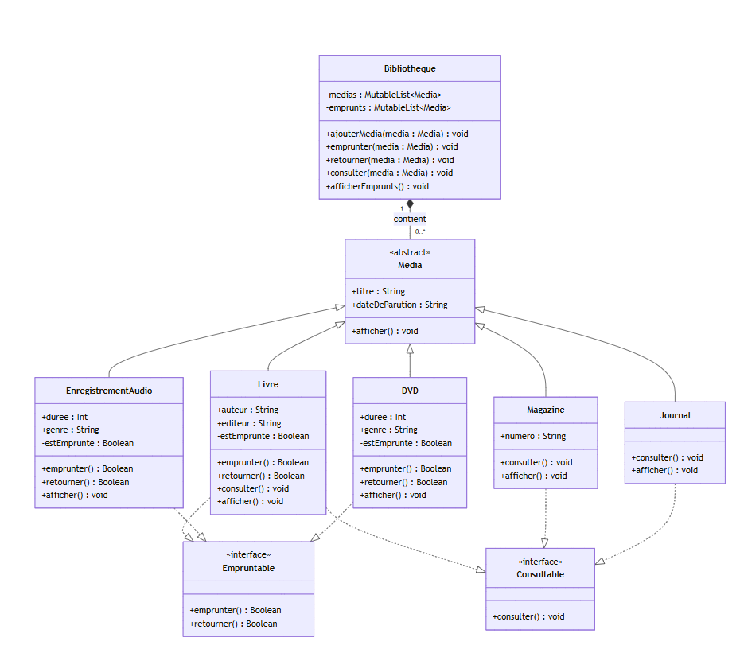

# Mini-Projet : Système de Gestion de Bibliothèque

Projet Kotlin réalisé dans le cadre du cours de Jetpack Android Kotlin à l'ESGI.  
Date : 13/06/2026

## Objectif

Développer un système de gestion de bibliothèque en Kotlin permettant d'emprunter, retourner et consulter différents types de médias (Livres, Magazines, Journaux, Enregistrements Audio, DVD).  
Ce projet met en pratique la POO avancée : classes abstraites, interfaces, héritage, polymorphisme, collections et gestion des erreurs.

## Description

Chaque média hérite de la classe abstraite `Media`. Selon son type, il peut implémenter :
- `Empruntable` : permet l'emprunt et le retour (Livre, EnregistrementAudio, DVD)
- `Consultable` : permet la consultation sur place (Livre, Magazine, Journal)

La classe `Bibliotheque` gère deux listes : tous les médias et les emprunts en cours.  
`InitData.kt` pré-remplit une bibliothèque avec 36 médias variés (films FR/EN, livres classiques et modernes, magazines, journaux, audio).

## Structure du projet

```
Kotlin-Gestion-Bibliotheque/
└── src/
    ├── interfaces/
    │   ├── Empruntable.kt          # interface : emprunter() + retourner()
    │   └── Consultable.kt          # interface : consulter()
    ├── modeles/
    │   ├── Media.kt                # classe abstraite de base
    │   ├── Livre.kt                # Empruntable + Consultable
    │   ├── Magazine.kt             # Consultable uniquement
    │   ├── Journal.kt              # Consultable uniquement
    │   ├── EnregistrementAudio.kt  # Empruntable uniquement
    │   └── DVD.kt                  # Empruntable uniquement
    ├── tests/
    │   ├── TestSucces.kt           # tests des cas nominaux
    │   └── TestErreurs.kt          # tests des cas limites et erreurs
    ├── Bibliotheque.kt             # couche accès aux données
    ├── InitData.kt                 # données initiales variées (36 médias)
    ├── Menu.kt                     # menus interactifs (lancerMenu, sous-menus)
    ├── Simulation.kt               # simulation complète automatique (12 étapes)
    └── Main.kt                     # point d'entrée : appel de lancerMenu()
```

## Lancer le projet

1. Ouvrir le projet dans **IntelliJ IDEA**
2. Marquer `src/` comme **Sources Root** (clic droit → Mark Directory as → Sources Root)
3. Ouvrir `src/Main.kt`
4. Cliquer sur **Run** ou faire `Shift + F10`

## Ce qui a été implémenté

- Classe abstraite `Media` avec `titre`, `dateDeParution` et méthode abstraite `afficher()`
- Interface `Empruntable` avec `emprunter(): Boolean` et `retourner(): Boolean`
- Interface `Consultable` avec `consulter()`
- Classes `Livre`, `Magazine`, `Journal`, `EnregistrementAudio`, `DVD` héritant de `Media`
- Gestion de l'état d'emprunt (`private var estEmprunte`) dans chaque classe `Empruntable`
- Classe `Bibliotheque` avec deux `MutableList<Media>` (médias + emprunts en cours)
- Vérifications d'erreurs : média déjà emprunté, non-empruntable, non-consultable, retour invalide
- `InitData.kt` : bibliothèque pré-remplie avec des médias variés (FR/EN/international)
- `tests/TestSucces.kt` : 12 tests couvrant tous les cas nominaux
- `tests/TestErreurs.kt` : 6 tests couvrant tous les cas limites et comportements invalides
- `Menu.kt` : menu interactif entièrement numérique — ajout, consultation, emprunt, retour et affichage avec sélection du type puis de l'item

## Diagramme de classes



## Exécution


## Choix de conception

- **`Media` est abstraite** : on ne crée jamais un "média générique", seuls les types concrets ont du sens
- **Séparation `Empruntable` / `Consultable`** : tous les médias ne peuvent pas être empruntés (un journal se consulte sur place) ; les interfaces permettent d'exprimer exactement ce que chaque type peut faire
- **`DVD` et `EnregistrementAudio` n'implémentent pas `Consultable`** : la description fonctionnelle du sujet (page 1) précise explicitement que seuls les Livres, Magazines et Journaux sont consultables sur place (`"Permettre de consulter des médias sans les emporter (Livres, Magazines, Journaux)"`). Le guide des attributs (page 4) mentionne par ailleurs une méthode de consultation pour DVD et EnregistrementAudio, ce qui constitue une contradiction interne au sujet. J'ai choisi de suivre la description fonctionnelle (page 1), qui définit le comportement métier attendu, plutôt que le guide technique (page 4). Ce choix est validé par les tests d'erreurs : tenter de consulter un DVD ou un enregistrement audio retourne un message d'erreur explicite.
- **`estEmprunte` dans chaque classe** : chaque média est responsable de son propre état, ce qui respecte le contrat de l'interface et évite que `Bibliotheque` gère cet état à la place
- **`is` + smart cast dans `Bibliotheque`** : permet de vérifier le type dynamiquement (S9) avant d'appeler des méthodes spécifiques à une interface, sans risque d'exception
- **`MutableList<Media>`** : stockage polymorphe (S6) permettant d'appeler `afficher()` via polymorphisme sans connaître le type exact
- **`InitData.kt` séparé** : sépare les données de test de la logique métier pour faciliter la réutilisation et la lisibilité
- **`TestSucces.kt` / `TestErreurs.kt` séparés** : distingue clairement les tests nominaux des tests de robustesse
- **`Menu.kt` séparé** : isole toute la logique d'interaction utilisateur hors de `Main.kt` ; `filterIsInstance<T>()` (S6) permet de filtrer les médias par type pour afficher uniquement les choix pertinents à chaque étape

## Difficultés rencontrées

- **Implémenter deux interfaces à la fois** (`Livre` implémente `Empruntable` et `Consultable`) : résolue en utilisant la syntaxe `: Media(titre, dateDeParution), Empruntable, Consultable`
- **Gérer les cas d'erreur sans exceptions** : résolue par des vérifications explicites avec `is` et des gardes `if` en début de méthode dans `Bibliotheque`
- **Affichage polymorphe dans `afficherEmprunts()`** : résolue en appelant `afficher()` définie dans `Media` via `forEach`, laissant le polymorphisme choisir la bonne implémentation au moment de l'exécution
